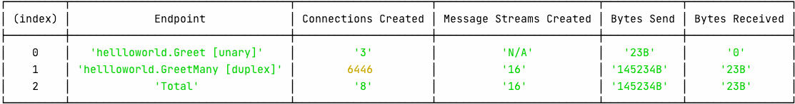

# Creating cli ui


**Active Connections**

| Endpoint                       | Connections Created | Message Streams Created | Bytes Send | Bytes Received |
| ------------------------------ | ------------------- | ----------------------- | ---------- | -------------- |
| hellloworld.Greet [unary]      | 3                   | N/A                     | 23B        | 0              |
| hellloworld.GreetMany [duplex] | 5                   | 16                      | 145234B    | 23B            |
| Total                          | 8                   | 16                      | 143354B    | 23B            |


```typescript
// @ts-ignore
const table = [
    {
        "Endpoint": "hellloworld.Greet [unary]",
        "Connections Created": "3",
        "Message Streams Created": "N/A",
        "Bytes Send": "23B",
        "Bytes Received": "0"
    },
    {
        "Endpoint": "hellloworld.GreetMany [duplex]",
        "Connections Created": "5",
        "Message Streams Created": "16",
        "Bytes Send": "145234B",
        "Bytes Received": "23B"
    },
    {
        "Endpoint": "Total",
        "Connections Created": "8",
        "Message Streams Created": "16",
        "Bytes Send": "145234B",
        "Bytes Received": "23B"
    }
]

console.table(table);
```


Result : 


### Auto updating the table

```typescript
let count = 0;
// @ts-ignore
const render = () => {
    console.clear();
    // @ts-ignore
    table[1]["Connections Created"] = (count+= parseInt(Math.random() * 10));
    console.table(table);
};

render();
setInterval(render, 500);
```




